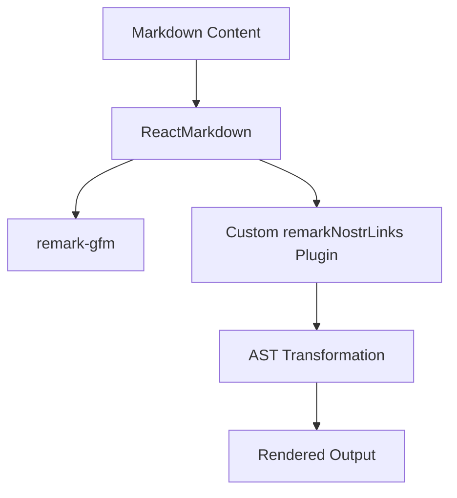

# Implementation Plan: Custom ReactMarkdown Plugin for Nostr Links

This document outlines the implementation plan for adding support for Nostr-specific links in markdown content without breaking the markdown structure in the petition-detail-widget component.

## Overview

The goal is to detect Nostr-specific links (matching the pattern `nostr:((note|npub|naddr|nevent|nprofile)1\w+)`) in markdown content and convert them to clickable links while preserving the markdown structure.



## Required Dependencies

Before implementing this solution, you need to install the following dependencies:

```bash
npm install remark-gfm unist-util-visit
```

## Implementation Steps

### Step 1: Create a New Utility File for the Plugin

Create a new file at:

```
src/features/petition-detail-widget/utils/remark-nostr-links.ts
```

With the following content:

```typescript
import { visit } from 'unist-util-visit';
import { Node } from 'unist';

interface TextNode extends Node {
  type: 'text';
  value: string;
}

interface LinkNode extends Node {
  type: 'link';
  url: string;
  children: Node[];
}

// The regex pattern for Nostr links
const mentionRegex = /\bnostr:((note|npub|naddr|nevent|nprofile)1\w+)\b/g;

// Function to determine the appropriate URL for a Nostr link
function getNostrLinkUrl(fullId: string, type: string): string {
  switch (type) {
    case 'note':
      return `/note/${fullId}`;
    case 'npub':
    case 'nprofile':
      return `/profile/${fullId}`;
    case 'nevent':
      return `/event/${fullId}`;
    case 'naddr':
      return `/address/${fullId}`;
    default:
      return `#${fullId}`;
  }
}

// The remark plugin function
export function remarkNostrLinks() {
  return (tree: Node) => {
    visit(tree, 'text', (node: TextNode, index, parent) => {
      if (!parent || index === null) return;

      const { value } = node;
      const matches = Array.from(value.matchAll(mentionRegex));

      if (matches.length === 0) return;

      // Create an array to hold the new nodes
      const newNodes: (TextNode | LinkNode)[] = [];
      let lastIndex = 0;

      for (const match of matches) {
        const [fullMatch, fullId, type] = match;
        const startIndex = match.index!;

        // Add text before the match
        if (startIndex > lastIndex) {
          newNodes.push({
            type: 'text',
            value: value.slice(lastIndex, startIndex)
          } as TextNode);
        }

        // Add the link node
        newNodes.push({
          type: 'link',
          url: getNostrLinkUrl(fullId, type),
          children: [{ type: 'text', value: fullMatch }]
        } as LinkNode);

        lastIndex = startIndex + fullMatch.length;
      }

      // Add any remaining text
      if (lastIndex < value.length) {
        newNodes.push({
          type: 'text',
          value: value.slice(lastIndex)
        } as TextNode);
      }

      // Replace the current node with the new nodes
      parent.children.splice(index, 1, ...newNodes);
    });
  };
}
```

### Step 2: Update the Petition Detail Widget

Update the petition-detail-widget component to use the custom plugin:

File: `src/features/petition-detail-widget/index.tsx`

```typescript
import { NDKEvent } from '@nostr-dev-kit/ndk';
import { useNdk, useActiveUser } from 'nostr-hooks';
import { memo, useEffect, useState } from 'react';
import ReactMarkdown from 'react-markdown';
import remarkGfm from 'remark-gfm';
import { useTranslation } from 'react-i18next';
import { Spinner } from '@/shared/components/spinner';
import { NoteHeader } from '@/features/note-widget/components/note-header';
import { PetitionTitle } from '@/features/petition-widget/components/petition-title';
import { PetitionImage } from '@/features/petition-widget/components/petition-image';
import { PetitionSummary } from '@/features/petition-widget/components/petition-summary';
import { usePetitionDetail } from './hooks';
import { NewPetitionCommentWidget } from '@/features/new-petition-comment-widget';
import { PetitionCommentsWidget } from '@/features/petition-comments-widget';
import { PetitionEndorseBtn } from './components/petition-endorse-btn';
import { PetitionEndorsementCount } from './components/petition-endorsement-count';
import { PetitionZapBtn } from './components/petition-zap-btn';
import { PetitionZapCount } from './components/petition-zap-count';
import { remarkNostrLinks } from './utils/remark-nostr-links';

// ... rest of the file remains the same ...

// Update the ReactMarkdown component in the PetitionDetail component:
{content && (
  <div className="prose dark:prose-invert max-w-none mb-6">
    <h3 className="text-xl font-semibold">{t('petition.detail.content')}</h3>
    <div className="markdown-content">
      <ReactMarkdown
        remarkPlugins={[remarkGfm, remarkNostrLinks]}
      >
        {content}
      </ReactMarkdown>
    </div>
  </div>
)}
```

### Step 3: Add CSS Styling (Optional)

You may want to add some CSS styling to make the Nostr links visually distinct. You can do this by adding a className to the link nodes in the remark-nostr-links.ts file:

```typescript
// Add the link node with a className
newNodes.push({
  type: 'link',
  url: getNostrLinkUrl(fullId, type),
  children: [{ type: 'text', value: fullMatch }],
  data: { hProperties: { className: 'nostr-link' } }
} as LinkNode);
```

Then add the corresponding CSS in your stylesheet:

```css
.nostr-link {
  color: #8b5cf6; /* Purple color */
  text-decoration: none;
}

.nostr-link:hover {
  text-decoration: underline;
}
```

## Alternative Implementation: Using mdast-util-find-and-replace

For a potentially simpler implementation, you could use the `mdast-util-find-and-replace` package:

```bash
npm install mdast-util-find-and-replace
```

Then modify the remark-nostr-links.ts file:

```typescript
import { findAndReplace } from 'mdast-util-find-and-replace';

// The regex pattern for Nostr links
const mentionRegex = /\bnostr:((note|npub|naddr|nevent|nprofile)1\w+)\b/g;

// Function to determine the appropriate URL for a Nostr link
function getNostrLinkUrl(fullId: string, type: string): string {
  switch (type) {
    case 'note':
      return `/note/${fullId}`;
    case 'npub':
    case 'nprofile':
      return `/profile/${fullId}`;
    case 'nevent':
      return `/event/${fullId}`;
    case 'naddr':
      return `/address/${fullId}`;
    default:
      return `#${fullId}`;
  }
}

export function remarkNostrLinks() {
  return (tree) => {
    findAndReplace(tree, [
      [mentionRegex, (match, fullId, type) => {
        return {
          type: 'link',
          url: getNostrLinkUrl(fullId, type),
          children: [{ type: 'text', value: match }],
          data: { hProperties: { className: 'nostr-link' } }
        };
      }]
    ]);
  };
}
```

## Testing

After implementing the solution, test it with various markdown content containing Nostr links to ensure:

1. Markdown structure is preserved
2. Nostr links are correctly identified and transformed
3. Links work correctly when clicked

## Next Steps

1. Install the required dependencies
2. Create the utils directory and remark-nostr-links.ts file
3. Update the petition-detail-widget/index.tsx file
4. Test the implementation with various markdown content
